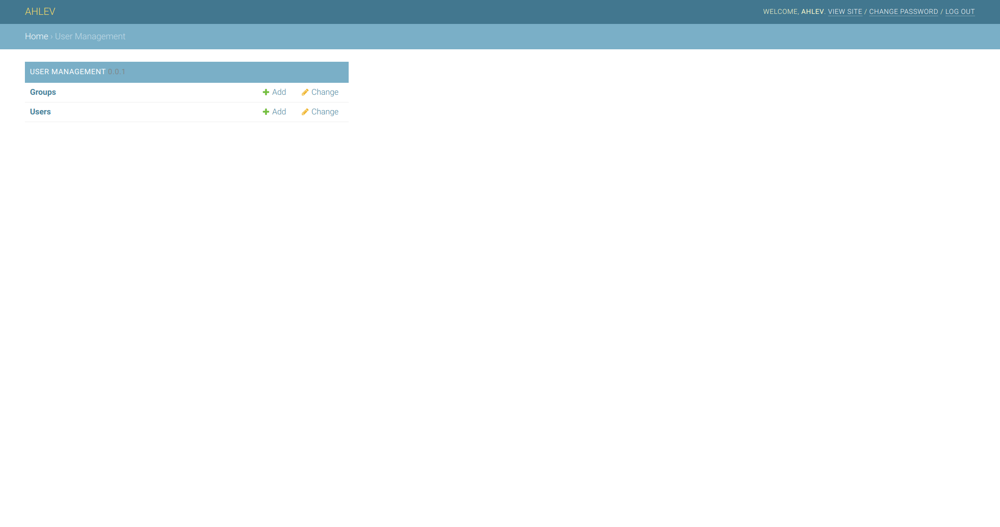

# DJANGO AUTH RENAME APPLICATION


This django application is used to rename the application label of [django.contrib.auth](https://docs.djangoproject.com/en/3.0/ref/contrib/auth/) from
```
Authentication And Authorization
```
to
```
User Management
```

## prerequisites
The instructions below assume that you have a django project already set up; and a python virtual environment already installed and activated. 

## styles
All ahlev-django applications are using styles from [mdbootstrap.com](https://mdbootstrap.com), so please make sure you install [ahlev-django-css-js](https://github.com/ohahlev/ahlev-django-css-js.git) first.


## install from this repository
### clone
```
git clone https://github.com/ohahlev/ahlev-django-auth-rename.git
```

### go to directory ahlev-django-auth-rename
```
cd ahlev-django-auth-rename
```

### create installer package
```
python3 setup.py sdist
```

### go to project directory
```
pip install dist/ahlev-django-auth-rename-0.0.1.tar.gz
```

## install from pypi


## project configuration
### update settings.py as the following
```
INSTALLED_APPS = [
    'auth_rename', # add this line, and comment the below
    #'django.contrib.auth', 
]
```

## screenshots
### backend: user management
